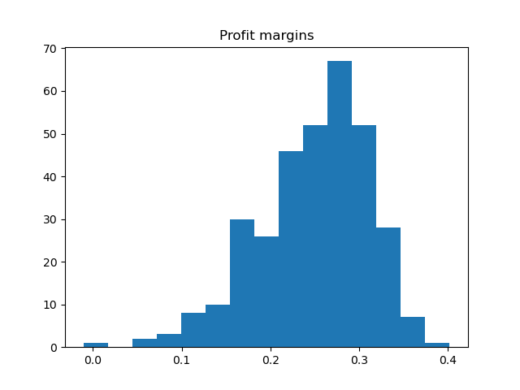

# stores
## Part 1: 
Across all stores, the mean annual profit margin was 24.9% and the median was 26.2%. Below is a histogram of the distribution: 

These profit margins do not appear normally distributed; the data exhibits significant left skew, with several stores trailing far below the typical range of profit margins. These outliers can be easily seen in the box plot: 

A QQ plot confirms that the data is not normally distributed, with significant divergence from the centerline at the tails of the distribution: 

Finally, a Shapiro-Wilk test for normalcy returns a p-value of 5 x 10-7, well below a reasonal threshold of 0.01 and thus rejecting the hypothesis that the profit margins are normally distributed.

The monthly and quarterly revenue can be seen below:  

These charts show an outperformance in the first quarter, and a pattern of higher revenues in the last month of every quarter. Percent deviations from mean revenues more clearly highlight these trends:  

## Part 2:
To impute an appropriate rental cost for each owned location, I chose to use a multiple regression model using the annualized costs, states, and numbers of products for each store. In order to eliminate unneccessary or redundant variables, I used a reverse feature elimination algorithm to eliminate the *n* least statistically significant variables. Then, I used k-fold cross-validation to divide the leased-location data into training and testing sets in order to determine which number of variables *n* yielded the most effective model. 

The results, including rent-adjusted profit margin, can be found in sheet [Adjusted](adjusted.csv)

## Part 3:
To identify factors leading to historical outperformance and build a set of recommendations for the CEO, I took two approaches.

First, I performed another regression using a similar process as above to determine common drivers of succes. In particular, I looked at the breakdown of spending across variable costs, fixed costs, and rent; the state each store was in; and the number of products sold. I found that stores in Texas and California were the most successful, while Georgia and New Jersey trailed significantly. I also found that stores which sold more products performed better. Lastly, I found that stores with higher rental costs (relative to total costs) performed better, while those who spend more on fixed and variable costs performed worse; however, I would caution that this element is susceptible to any errors made in Part 2 of my analysis. The output of this analysis can be found here: [Drivers](drivers.csv)

Second, I performed an operations research technique called Data Envelopment Analysis to analyze the efficiency of each store. In brief, this model acknowledges that some stores may inherently have different constraints on their costs, and seeks to compare each store to the others most similar to itself. The output efficiency score for each store is percent of maximum revenue per cost for the best-performing store with a similar breakdown of inputs. Finally, I output the number this most-comprable, best-performing store for each store in the dataset, so that underperforming store managers can examine and learn from their peers to improve their operations. The output from this analysis can be found here: [Efficiency](efficiency.csv)
